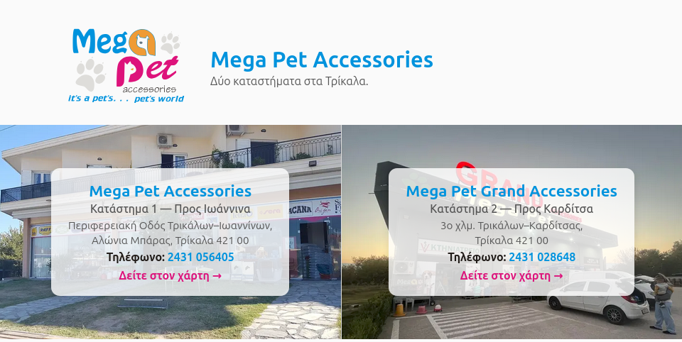
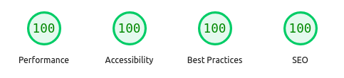

# Mega Pet Accessories Landing Page

Static, highly optimized landing page for Mega Pet Accessories, a local pet shop chain with two stores in Trikala, Greece. The page focuses on fast performance, clear store info, and subtle motion effects.



## Features

- **Two-location highlight**:
  
  Split layout showcases both stores with map links, addresses, and phone numbers.

- **Light parallax & zoom**:

  Background photos animate differently on mobile and desktop for a polished feel.

- **Responsive hero**:

  Logo, title, and tagline adapt across screen sizes.

- **Accessibility**:

  Semantic structure (header/main/footer), explicit image dimensions, reduced-motion support.

- **Performance-first**:

  Responsive WebP `srcset`, `preload` for the LCP image, and long-lived caching via `.htaccess`.
  
  

## Development

Requirements: any static web server. To work locally:

```bash
git clone https://github.com/dimitrios-git/megapet
cd megapet
python3 -m http.server 8080
# open http://localhost:8080
```

### Image workflow

Place full-size WebP files as `*.1920.webp` and run:

```bash
./generate-images.sh
```

This creates 1600/1280/800/400 widths with tuned quality settings, matching the `srcset` definitions in `index.html`.

### Deployment

Upload the contents to your Apache/Hetzner hosting. Ensure `.htaccess` is deployed so static assets get the intended caching headers.

## License

[MIT](LICENSE)
